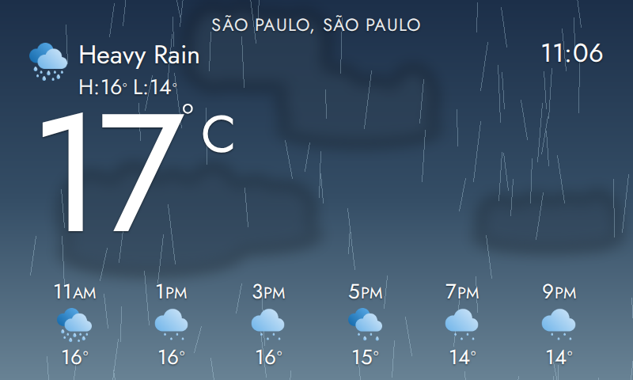
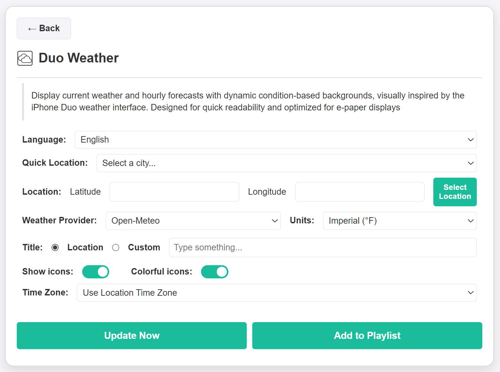

# Duo Weather Plugin for InkyPi

A weather plugin focused on current conditions and hourly forecasts, with dynamic condition-based backgrounds visually inspired by the iPhone Duo weather interface

Duo Weather combines large weather information, hourly forecasting and changing visual backgrounds in a layout designed for quick readability on e-paper displays

## Install

Install the plugin using the InkyPi CLI:

    inkypi plugin install duo_weather https://github.com/saulob/InkyPi-Duo-Weather

This plugin is an extension for the [InkyPi](https://github.com/fatihak/InkyPi) e-paper display frame and includes the following features:

## Features

* Current weather conditions
* Current temperature
* High and low temperatures
* Hourly weather forecast
* Weather condition icons
* Dynamic backgrounds based on weather conditions
* Multi-language support
* Quick location selection
* Manual latitude and longitude input
* Metric and Imperial units
* Horizontal and vertical layout support
* Optimized for e-paper displays

## Settings

* Language selection
* Quick Location presets or manual latitude and longitude
* Unit selection
* Weather location configuration
* Visual and layout customization

## Weather Backgrounds

The plugin dynamically changes its visual background according to the current weather condition

Supported visual conditions include clear, cloudy, overcast, rain and other weather states, while maintaining strong contrast and readability for e-paper displays

## UI

* Large current temperature and weather condition
* Hourly forecast for quick weather overview
* High and low temperature indicators
* Dynamic condition-based visual backgrounds
* Layout automatically adapts to different screen orientations
* Visual style inspired by the iPhone Duo weather interface

## Notes

* Designed for quick glance scenarios
* Dynamic backgrounds are generated according to current weather conditions
* Works with horizontal and vertical InkyPi layouts
* Optimized for readability and contrast on e-paper displays

## Screenshots

- Duo Weather widget on the main dashboard
- Plugin settings screen

   
